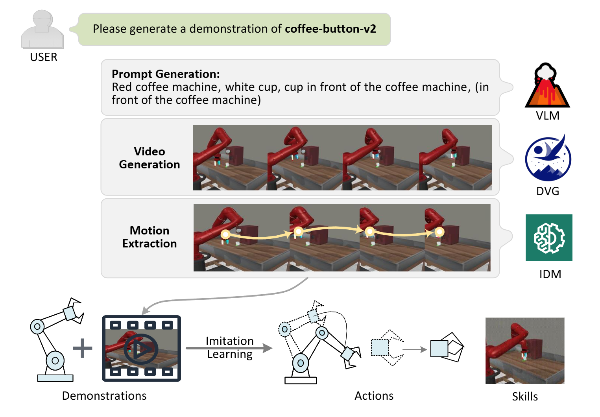

# Learning Novel Skills from Language-Generated Demonstrations

**Description**  
This project focuses on building a skill learning framework that enables robots to acquire novel skills from natural language instructions. 
The proposed pipeline leverages vision-language models to generate demonstration videos of novel skills.



## Features  
- **Modular Design**: Each module is independently structured, allowing for standalone training and debugging.  

- **Interchangeable Models**: Different generative models can be seamlessly swapped within each module, enabling flexible experimentation and performance optimization.  

## Source Code  
Source code is coming soon! 🚀  

## Roadmap  
1. [ ] Release source code & data.
2. [ ] Tested on different models & environments.

## Citation  
If you think this project is helpful, please feel free to leave a star⭐️⭐️⭐️ and cite our paper:

```bibtex
@misc{jin2024learningnovelskillslanguagegenerated,
      title={Learning Novel Skills from Language-Generated Demonstrations}, 
      author={Ao-Qun Jin and Tian-Yu Xiang and Xiao-Hu Zhou and Mei-Jiang Gui and Xiao-Liang Xie and Shi-Qi Liu and Shuang-Yi Wang and Yue Cao and Sheng-Bin Duan and Fu-Chao Xie and Zeng-Guang Hou},
      year={2024},
      eprint={2412.09286},
      archivePrefix={arXiv},
      primaryClass={cs.RO},
      url={https://arxiv.org/abs/2412.09286}, 
}
```

## Acknowledgments  
- **The State Key Laboratory of Multimodal Artificial Intelligence Systems, Institute of Automation, Chinese Academy of Sciences.**
- Special thanks to the help of Tian-Yu Xiang and Fu-Chao Xie, and the support of supervisor Xiao-Hu Zhou.
- This repository borrows heavily from [FollowYourPose](https://github.com/mayuelala/FollowYourPose). thanks the authors for sharing their code and models.
